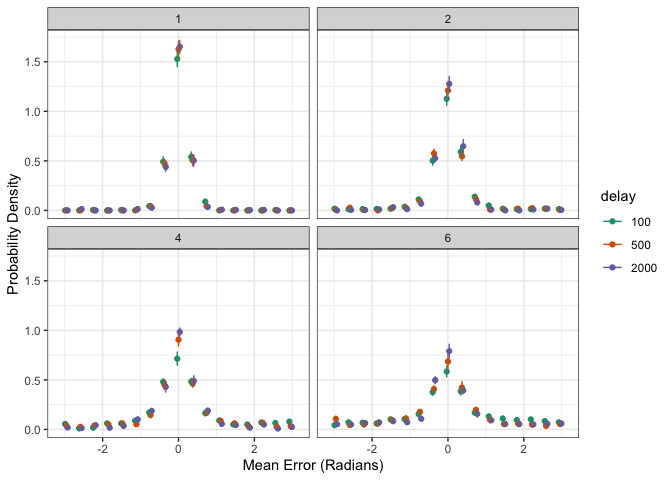
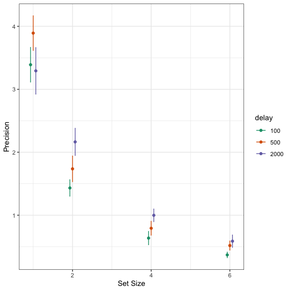
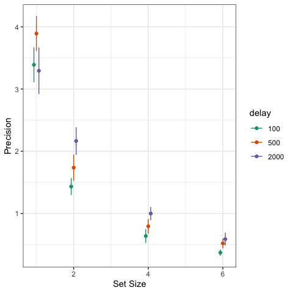

# mixtur: An R package for designing, analysing, and modelling continuous report visual short-term memory studies

**mixtur** is a package to assist researchers in designing, analysing,
and modelling data from continuous report visual short-term memory
studies.

## Installation

To install the package from GitHub, you need the devools package:

``` r
install.packages("devtools")
library(devtools)
```

Then **mixtur** can be directly installed:

``` r
devtools::install_github("JimGrange/mixtur")
```

## Continuous Report Tasks


In continuous report tasks, participants are presented with an encoding
screen with items to remember (in this example, the participants need to
recall the colours of the squares). After a retention interval, one of
the squares is probed (highlighted here by the darkened square), and the
participants’ task is to recall the colour of the probed item.

The participant makes their response on a colour wheel, and the
dependent variable is the angular deviation between the participant’s
response (R) and the true target value (T) in radians.

After many trials, a probability density distribution can be formed of
the response errors across participants.

## Example Data

**mixtur** includes several example data sets to allow the user to
familiarise themselves with the package:

  - **bays2009\_full**: The full data set from Bays et al. (2009)
    including set size manipulations (1, 2, 4, and 6 items) plus a
    manipulation of *delay* of the retention interval (100ms, 500ms, and
    2,000ms).
  - **bays2009\_sample**: A sample from Bays et al. (2009).

Data can be loaded in the following way:

``` r
library(mixtur)
data(bays2009_sample)
head(bays2009_sample)
#>   id response target non_target_1 non_target_2 non_target_3
#> 1  1   -2.186 -0.002       -2.989        2.648        2.262
#> 2  1   -1.980 -2.498       -1.861       -1.340       -0.309
#> 3  1   -0.177 -2.088       -2.845       -3.102       -0.371
#> 4  1    1.342  1.334        2.844        1.007       -0.599
#> 5  1   -1.644 -2.224        3.129        2.936        1.295
#> 6  1    1.219  1.253        2.886       -0.924       -1.035
```

## Plotting response error

``` r
library(mixtur)

# example data
data(example_data)

# plot overall error
plot_error(data = example_data, 
           unit = "degrees", 
           condition_var = "NULL", 
           set_size_var = "NULL")
#> $plot
```

<!-- -->

    #> 
    #> $plot_data
    #> # A tibble: 17 x 3
    #>         x mean_error se_error
    #>     <dbl>      <dbl>    <dbl>
    #>  1 -2.96      0.0529  0.00702
    #>  2 -2.59      0.0527  0.00572
    #>  3 -2.22      0.0563  0.00645
    #>  4 -1.85      0.0640  0.00668
    #>  5 -1.48      0.0705  0.00622
    #>  6 -1.11      0.0857  0.00877
    #>  7 -0.739     0.152   0.0105 
    #>  8 -0.370     0.400   0.0187 
    #>  9  0         0.817   0.0475 
    #> 10  0.370     0.383   0.0160 
    #> 11  0.739     0.152   0.0106 
    #> 12  1.11      0.105   0.0101 
    #> 13  1.48      0.0709  0.00755
    #> 14  1.85      0.0600  0.00703
    #> 15  2.22      0.0564  0.00611
    #> 16  2.59      0.0606  0.00891
    #> 17  2.96      0.0677  0.00541

``` r
# plot error by condition (condition b is easier than condition a)
plot_error(data = example_data, 
           unit = "degrees", 
           condition_var = "condition", 
           set_size = "NULL")
#> $plot
```

<!-- -->

    #> 
    #> $plot_data
    #> # A tibble: 34 x 4
    #> # Groups:   condition [2]
    #>    condition      x mean_error se_error
    #>    <fct>      <dbl>      <dbl>    <dbl>
    #>  1 a         -2.96      0.0630  0.00913
    #>  2 a         -2.59      0.0581  0.00863
    #>  3 a         -2.22      0.0641  0.0116 
    #>  4 a         -1.85      0.0638  0.0105 
    #>  5 a         -1.48      0.0773  0.0113 
    #>  6 a         -1.11      0.0914  0.0157 
    #>  7 a         -0.739     0.167   0.0149 
    #>  8 a         -0.370     0.356   0.0191 
    #>  9 a          0         0.800   0.0556 
    #> 10 a          0.370     0.349   0.0207 
    #> # … with 24 more rows

``` r
# sample of bays (2009) data
data("bays2009_sample")
plot_error(data = bays2009_sample, 
           unit = "radians", 
           condition_var = "NULL", 
           set_size_var = "NULL")
#> $plot
```

<!-- -->

    #> 
    #> $plot_data
    #> # A tibble: 17 x 3
    #>         x mean_error se_error
    #>     <dbl>      <dbl>    <dbl>
    #>  1 -2.96      0.0392   0.0148
    #>  2 -2.59      0.0267   0.0106
    #>  3 -2.22      0.0386   0.0175
    #>  4 -1.85      0.0504   0.0222
    #>  5 -1.48      0.0599   0.0182
    #>  6 -1.11      0.0514   0.0165
    #>  7 -0.739     0.144    0.0261
    #>  8 -0.370     0.449    0.0480
    #>  9  0         0.902    0.0655
    #> 10  0.370     0.464    0.0394
    #> 11  0.739     0.171    0.0225
    #> 12  1.11      0.0880   0.0240
    #> 13  1.48      0.0611   0.0171
    #> 14  1.85      0.0323   0.0110
    #> 15  2.22      0.0675   0.0159
    #> 16  2.59      0.0277   0.0128
    #> 17  2.96      0.0331   0.0137

``` r
# bays (2009) full data set
data(bays2009_full)

plot_error(data = bays2009_full,
           unit = "radians",
           set_size_var = "set_size", 
           condition_var = "NULL")
#> $plot
```

<!-- -->

    #> 
    #> $plot_data
    #> # A tibble: 68 x 4
    #> # Groups:   set_size [4]
    #>    set_size      x mean_error se_error
    #>       <dbl>  <dbl>      <dbl>    <dbl>
    #>  1        1 -2.96     0        0      
    #>  2        1 -2.59     0.00449  0.00323
    #>  3        1 -2.22     0.00151  0.00151
    #>  4        1 -1.85     0        0      
    #>  5        1 -1.48     0.00151  0.00151
    #>  6        1 -1.11     0.00599  0.00404
    #>  7        1 -0.739    0.0389   0.0111 
    #>  8        1 -0.370    0.469    0.0395 
    #>  9        1  0        1.60     0.0661 
    #> 10        1  0.370    0.515    0.0446 
    #> # … with 58 more rows

``` r
# by set size & condition

plot_error(data = bays2009_full,
           unit = "radians",
           set_size_var = "set_size", 
           condition_var = "delay")
#> $plot
```

<!-- -->

    #> 
    #> $plot_data
    #> # A tibble: 204 x 5
    #> # Groups:   set_size, delay [12]
    #>    set_size delay      x mean_error se_error
    #>       <dbl> <fct>  <dbl>      <dbl>    <dbl>
    #>  1        1 100   -2.96     0        0      
    #>  2        1 100   -2.59     0        0      
    #>  3        1 100   -2.22     0.00470  0.00470
    #>  4        1 100   -1.85     0        0      
    #>  5        1 100   -1.48     0.00443  0.00443
    #>  6        1 100   -1.11     0        0      
    #>  7        1 100   -0.739    0.0442   0.0215 
    #>  8        1 100   -0.370    0.491    0.0537 
    #>  9        1 100    0        1.53     0.0791 
    #> 10        1 100    0.370    0.540    0.0518 
    #> # … with 194 more rows

## Plotting precision of reponses

``` r
data <- bays2009_full
# plot just mean
plot_precision(data, unit = "radians",
               condition_var = "NULL",
               set_size = "NULL")
#> $plot
#> [1] "NULL"
#> 
#> $plot_data
#> # A tibble: 1 x 4
#>   mean_precision se_precision mean_bias se_bias
#>            <dbl>        <dbl>     <dbl>   <dbl>
#> 1           1.06       0.0826   0.00964 0.00864
```

``` r
# plot just set size
plot_precision(data, unit = "radians",
               condition_var = "NULL",
               set_size_var = "set_size")
#> $plot
```

<!-- -->

    #> 
    #> $plot_data
    #> # A tibble: 4 x 5
    #>   set_size mean_precision se_precision mean_bias se_bias
    #>      <dbl>          <dbl>        <dbl>     <dbl>   <dbl>
    #> 1        1          3.39        0.243    0.00676  0.0107
    #> 2        2          1.72        0.153    0.0107   0.0114
    #> 3        4          0.820       0.0917   0.0171   0.0145
    #> 4        6          0.508       0.0555  -0.0120   0.0440

``` r
# plot just condition (delay)
plot_precision(data, unit = "radians",
               condition_var = "delay",
               set_size_var = "NULL")
#> $plot
```

<!-- -->

    #> 
    #> $plot_data
    #> # A tibble: 3 x 5
    #>   delay mean_precision se_precision mean_bias se_bias
    #>   <fct>          <dbl>        <dbl>     <dbl>   <dbl>
    #> 1 100            0.873       0.0630   0.0343   0.0184
    #> 2 500            1.08        0.101   -0.00218  0.0149
    #> 3 2000           1.22        0.117   -0.00149  0.0112

``` r
# plot set size AND condition
plot_precision(data, unit = "radians",
               condition_var = "delay",
               set_size_var = "set_size")
#> $plot
```

<!-- -->

    #> 
    #> $plot_data
    #> # A tibble: 12 x 6
    #> # Groups:   set_size [4]
    #>    set_size delay mean_precision se_precision mean_bias se_bias
    #>       <dbl> <fct>          <dbl>        <dbl>     <dbl>   <dbl>
    #>  1        1 100            3.39        0.275   0.0167   0.0171 
    #>  2        1 500            3.89        0.275  -0.00100  0.00989
    #>  3        1 2000           3.29        0.370   0.00472  0.0114 
    #>  4        2 100            1.43        0.131   0.0299   0.0258 
    #>  5        2 500            1.74        0.204  -0.000248 0.0115 
    #>  6        2 2000           2.16        0.216   0.00560  0.0210 
    #>  7        4 100            0.637       0.106   0.0305   0.0242 
    #>  8        4 500            0.793       0.110   0.0305   0.0340 
    #>  9        4 2000           0.998       0.101   0.00294  0.0233 
    #> 10        6 100            0.369       0.0443  0.0949   0.0764 
    #> 11        6 500            0.518       0.0724 -0.0777   0.0760 
    #> 12        6 2000           0.587       0.0983 -0.0493   0.0567

``` r
data <- example_data
plot_precision(data, unit = "degrees", 
               condition_var = "condition")
#> $plot
```

<!-- -->

    #> 
    #> $plot_data
    #> # A tibble: 2 x 5
    #>   condition mean_precision se_precision mean_bias se_bias
    #>   <fct>              <dbl>        <dbl>     <dbl>   <dbl>
    #> 1 a                  0.508       0.0506    0.0355  0.0327
    #> 2 b                  0.618       0.0580    0.0139  0.0227

## References
