# mixtur: An R package for designing, analysing, and modelling continuous report visual short-term memory studies

## ToDo List

  - Plotting
      - ~~plot response error~~
      - ~~plot precision of responses~~
      - ~~need to test degress\_180 data works~~
  - Analysing
      - ~~return response error by id for inferential analysis (is this
        even worthwhile??)~~
      - ~~return precision by id for inferential analysis~~
  - Modelling
      - ~~fit the 3-component model to data~~
      - ~~fit the 2-component model to data~~
      - ~~plot model parameters~~
      - ~~plot model fit against participant error data~~
      - ~~need to test degress\_180 data works~~
      - ~~return log-likelihood of fit?~~
      - ~~formal model comparison tests?~~
  - Simulating
      - ~~base simulate\_mixtur function~~
      - ~~check parameter recovery 3-component~~
      - ~~check parameter recovery 2-component~~
      - ~~check model recovery (e.g., sim from 2-component, and see if
        2-component wins model competition).~~
  - General
      - update documentation of all functions
      - add more example data sets
      - vignettes for all functions & use cases
  - Designing
      - ~~generate trial-level data for a user’s experiment~~
      - ensure this works for multiple participants
      - cie-lab calculation
      - cie2rgb converter
      - rgb2cie converter

## Contents

  - [Package Overview](#package-overview)
      - [How to install the package](#installation)
      - [An overview of continuous report
        tasks](#continuous-report-tasks)
      - [Example data shipped with mixtur](#example-data)
      - [An overview of data structures in
        mixtur](#data-structures-in-mixtur)
  - [Plotting: Visualising behavioural data](#plotting)
      - [Plotting response error](#plotting-response-error)
      - [Plotting response precision](#plotting-precision-of-responses)
  - [Analysing: Preparing data for inferential analysis](#analysing)
  - [Modelling: Fitting mixture models to data](#modelling)
      - [2-component mixture models](#two-component-mixture-models)
      - [3-component mixture models](#three-component-mixture-models)
      - [Formal model comparison](#formal-model-comparison)
  - [Plotting 2: Visualising model
    data](#plotting-2-visualising-model-data)
      - [Plotting model fit](#plotting-model-fit)
      - [Plotting model parameter
        values](#plotting-model-parameter-values)
  - [Simulating: Generating data from mixture
    models](#simulating-generating-data-from-mixture-models)
  - [Designing: Experiment design tools](#designing)
  - [References](#references)

## Package Overview

**mixtur** is a package to assist researchers in designing, analysing,
and modelling data from continuous report visual short-term memory
studies.

### Installation

To install the package from GitHub, you need the devtools package:

``` r
install.packages("devtools")
library(devtools)
```

Then **mixtur** can be directly installed:

``` r
devtools::install_github("JimGrange/mixtur")
```

### Continuous report tasks

The package is designed to assist researchers using continuous report
measures of visual short term memory. In continuous report tasks,
participants are presented with an encoding screen with items to
remember (in the example below, the participants need to recall the
colours of the squares). After a retention interval, one of the items is
probed (highlighted here by the darkened square), and the participants’
task is to recall the feature value (e.g., colour) of the probed item.


The participant makes their response on a colour wheel, and the
dependent variable is the angular deviation between the participant’s
response (R) and the true target value (T). After many trials, a
probability density distribution can be formed of the response errors
across participants.

### Example data

**mixtur** includes several example data sets to allow the user to
familiarise themselves with the package:

  - **bays2009\_full**: The full data set from Bays et al. (2009)
    including data from 12 participants. The data includes set size
    manipulations (1, 2, 4, and 6 items) plus a manipulation of *delay*
    of the retention interval (100ms, 500ms, and 2,000ms). The response,
    target, and non-target values are in radians (-pi to pi).
  - **bays2009\_sample**: A sample of data taken from the full data from
    Bays et al. (2009). This data just consists of set sizes of 4 and
    delay of 500ms. This sample data is provided if the user wishes to
    interact with a simpler data structure. The response, target, and
    non-target values are in radians (-PI to PI).
  - **berry\_2009**: TODO - Write blurb about studt. Data set has
    response, target, and non-target values in degrees in the range -180
    to 180.

Data can be loaded in the following way:

``` r
library(mixtur)

# load the full data
data(bays2009_full)

# look at the top of the data
head(bays2009_full)
#>   id set_size delay response target non_target_1 non_target_2 non_target_3
#> 1  1        1   100   -0.651 -0.638           NA           NA           NA
#> 2  1        1   100    2.042  2.108           NA           NA           NA
#> 3  1        1   500   -2.953  3.141           NA           NA           NA
#> 4  1        1   500    1.918  2.368           NA           NA           NA
#> 5  1        1   500   -0.176 -0.155           NA           NA           NA
#> 6  1        1   100   -2.683 -2.609           NA           NA           NA
#>   non_target_4 non_target_5
#> 1           NA           NA
#> 2           NA           NA
#> 3           NA           NA
#> 4           NA           NA
#> 5           NA           NA
#> 6           NA           NA
```

### Data structures in mixtur

**mixtur** has some flexibility in the data structures it can deal with,
but you need to tell **mixtur** some things about your data so it can
work. The data should be in long format (where rows indicate separate
trials, and columns indicate trial information). Typically the data
should have the following columns (note your columns do not necessarily
need these names as you can set this within function calls; see examples
later).

  - **id:** A column indicating the participant numbers / identifiers.
  - **response:** A column providing the participant response value.
    This can either be in degrees (i.e., 1-360), degrees limited to the
    range 1-180 (i.e., if your experiment uses bar orientations), or
    radians (typically in the range 0-2PI, but could also be -PI to PI).
  - **target:** A column providing the target value. This will be used
    by the **mixtur** package to calculate response error (i.e., the
    deviation between the participant’s response and the target value).
  - **non-target:** If the experiment had set sizes greater than one,
    the data should include columns that provide the non-target values
    (one column for each non-target). If there is more than one
    non-target, each column name should begin with a common term (e.g.,
    the “non-target” term is common to the non-target columns
    “non\_target\_1”, “non\_target\_2” etc.).
  - **set-size:** A column indicating the current trial’s set size
    (i.e., number of items to remember during the encoding phase), if
    your experiment manipulated this.
  - **other condition:** A column indicating the current trial’s
    condition if your experiment had an additional manipulation (for
    example the *delay* of the retention interval, as in the Bays
    \[2009\] data).

## Plotting

### Plotting response error

Response error refers to the angular deviation between the participant’s
response and the location of the true target value (i.e., where
participants *should* have responded). The plot functions returns the
probability density of response error averaged across participants
together with standard errors. (Unless told otherwise, **mixtur** will
assume you have multiple participants in your data, and will therefore
average across these participants.)

The function—*plot\_error*—takes the following arguments:

  - **data:** A data frame containing the data that is to be plotted.
    See the [data structure section](#data-structures-in-mixtur) for how
    this should be formatted.
  - **unit:** A character variable indicating the unit of measurement in
    the data. **mixtur** accepts units in degrees (1-360), degrees\_180
    capped at 180 (1-180), and radians (either 0-2PI or -PI to PI).
    Defaults to “degrees”.
  - **id\_var:** A character variable indicating the column name that
    codes for participant identification. Defaults to “id”.
  - **response\_var:** A character variable indicating the column name
    that codes for participants’ responses. Defaults to “response”.
  - **target\_var:** A character variable indicating the column name
    that codes for the target value. Defaults to “target”.
  - **set\_size\_var:** If set size was manipulated, a character
    variable indicating the column name that codes for the set size.
    Defaults to NULL.
  - **conditon\_var:** If an additional condition was manipulated, a
    character indicating the column name that codes for this condition.
    Defaults to NULL.
  - **return\_data:** A logical variable (“TRUE” or “FALSE”) indicating
    whether the plot data should be returned by the function. By
    default, the function will just return the plot itself (i.e.,
    return\_data = “FALSE”), but having the data returned allows the
    user to customise the plots further.

#### Examples

In the following we use the example data sets shipped with **mixtur**.

In a first example, we will use just the sample data from Bays et
al. (2009). Recall that the units in this data are in radians, so we
need to inform **mixtur** of this in the function call. As there was no
set size manipulation in this sample, and no other condition
manipulation, we do not need to set any other variables.

``` r
# load the sample of bays (2009) data
data(bays2009_sample)

# do the plotting
plot_error(data = bays2009_sample, 
           unit = "radians")
```

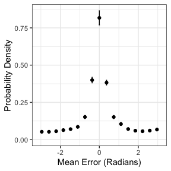<!-- -->

If you wish to receive the data underpinning the plot, save the
plot\_error call to a new variable and set *return\_data* to TRUE.

``` r
my_data <- plot_error(data = bays2009_sample, 
                      unit = "radians",
                      return_data = TRUE)
```

The data can then be accessed in the following way:

``` r
my_data$data
#> # A tibble: 17 x 3
#>         x mean_error se_error
#>     <dbl>      <dbl>    <dbl>
#>  1 -2.96      0.0392   0.0148
#>  2 -2.59      0.0267   0.0106
#>  3 -2.22      0.0386   0.0175
#>  4 -1.85      0.0504   0.0222
#>  5 -1.48      0.0599   0.0182
#>  6 -1.11      0.0514   0.0165
#>  7 -0.739     0.144    0.0261
#>  8 -0.370     0.449    0.0480
#>  9  0         0.902    0.0655
#> 10  0.370     0.464    0.0394
#> 11  0.739     0.171    0.0225
#> 12  1.11      0.0880   0.0240
#> 13  1.48      0.0611   0.0171
#> 14  1.85      0.0323   0.0110
#> 15  2.22      0.0675   0.0159
#> 16  2.59      0.0277   0.0128
#> 17  2.96      0.0331   0.0137
```

In the full data set, Bays et al. (2009) also had a set-size
manipulation. Participants were presented with either 1, 2, 4, or 6
items to remember in the encoding phase. To plot how response error
varies by set size, we need to tell the plot\_error function the column
name that codes for our set size variable. Note that in the example the
column name is usefully set as *set\_size*, but it needn’t be this
useful (it could—for example—be as ridiculous as *womble*); just tell
**mixtur** what it is called and it will do the rest\!

``` r
# load bays (2009) full data set
data(bays2009_full)

# do the plotting
plot_error(data = bays2009_full,
           unit = "radians",
           set_size_var = "set_size", 
           condition_var = NULL)
```

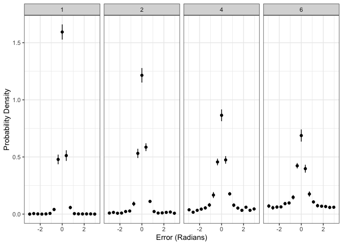<!-- -->

Maybe your experiment didn’t manipulate set size, but it did manipulate
something else. In the full data set of Bays et al. (2009) they
manipulated the *delay* of the retention interval. To plot how response
error varies by a factor other than set size, we need to tell the
plot\_error function the column name that codes for it (using the
*condition\_var* variable):

``` r
# plot response error by condition
plot_error(data = bays2009_full,
           unit = "radians",
           condition_var = "delay")
```

<!-- -->

Maybe your experiment manipulated both set size AND an additional
condition. No worries; **mixtur** can handle this. By default the
plot\_error function will return a plot where the *set\_size* variable
is represented by different panels, and the *condition* variable is
represented by different colours within the plots. At the moment this is
the default and only behaviour; if you wish to customise the plots
please use the *return\_data* variable.

``` r
# plot response error by set size & condition
plot_error(data = bays2009_full,
           unit = "radians",
           set_size_var = "set_size", 
           condition_var = "delay")
```

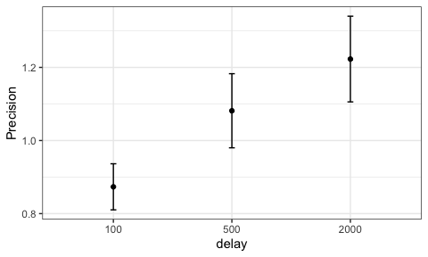<!-- -->

### Plotting precision of responses

Once response error is known, a formal estimate of the **precision** of
a participant’s response is possible. Following Bays et al. (2009),
precision is calculated as the reciprocol of the standard deviation of
the response error distribution (calculated as SD for circular space).
Below are two example conditions that differ in their precision:

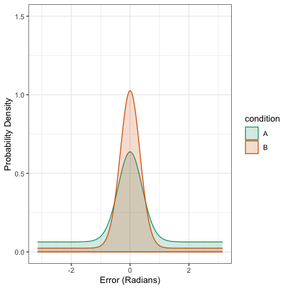<!-- -->

Condition A has lower precision (i.e., higher SD) than Condition B. The
arguments to pass to the function that calcualtes & plots
precision—*plot\_precision*—are the same as for the *plot\_error*
function.

#### Examples

In the first example, we plot mean precision across all participants as
a function of set size.

``` r

# load the data
data(bays2009_full)

# plot response precision by set size
plot_precision(data = bays2009_full, 
               unit = "radians",
               set_size_var = "set_size")
```

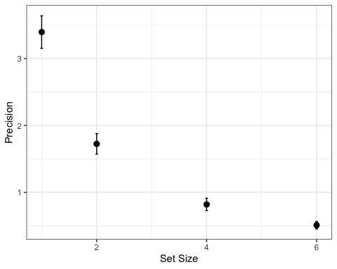<!-- -->

Again, if we wanted the data underlying the plot, we can ask **mixtur**
for this:

``` r

# plot response precision by set size
plot_data <- plot_precision(data = bays2009_full, 
                            unit = "radians",
                            set_size_var = "set_size", 
                            return_data = TRUE)

# show the data
plot_data$data
#> # A tibble: 4 x 5
#>   set_size mean_precision se_precision mean_bias se_bias
#>      <dbl>          <dbl>        <dbl>     <dbl>   <dbl>
#> 1        1          3.40        0.244    0.00679  0.0108
#> 2        2          1.72        0.153    0.0107   0.0114
#> 3        4          0.819       0.0917   0.0172   0.0144
#> 4        6          0.508       0.0555  -0.0120   0.0441
```

Note that when you return the data from a plot there is data concerning
*bias*. This is a measure of response bias (i.e., responses with no bias
should be near zero), and is not used further in this package.

Note that if you have no conditions and no set-size manipulation, the
plotting function doesn’t return anything. This is because in effect you
are asking to just plot one data point, which doesn’t seem worthwhile.

Instead, just ask for the plot data.

``` r
plot_data <- plot_precision(data = bays2009_full, 
                            unit = "radians",
                            condition_var = NULL,
                            set_size_var = NULL, 
                            return_data = TRUE)
plot_data$data
#> # A tibble: 1 x 4
#>   mean_precision se_precision mean_bias se_bias
#>            <dbl>        <dbl>     <dbl>   <dbl>
#> 1           1.06       0.0826   0.00968 0.00863
```

In this example, we plot precision as a function of the *delay*
condition.

``` r
# plot just condition (delay)
plot_precision(data = bays2009_full, 
               unit = "radians",
               condition_var = "delay",
               set_size_var = NULL)
```

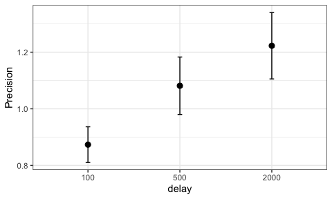<!-- -->

As before, if we want to plot both set size and an additional condition,
we can do so:

``` r
# plot set size AND condition
plot_precision(data = bays2009_full, 
               unit = "radians",
               condition_var = "delay",
               set_size_var = "set_size")
```

<!-- -->

## Analysing

Want to analyse the precision data that you’ve just plotted using your
favourite inferential method? No problem\! You just need to use the
*analyse\_precision* function, which behaves in almost the same way as
the *plot\_precision* function, except it just returns a data frame
grouped by participant id.

``` r

# save the new data frame to a variable
precision_data <- analyse_precision(data = bays2009_full, 
                                    unit = "radians",
                                    condition_var = "delay",
                                    set_size_var = "set_size")

# show the top of this new data frame
head(precision_data)
#> # A tibble: 6 x 5
#> # Groups:   id, condition [2]
#>      id condition set_size precision     bias
#>   <dbl> <fct>        <dbl>     <dbl>    <dbl>
#> 1     1 100              1     3.60  -0.0522 
#> 2     1 100              2     1.89  -0.0589 
#> 3     1 100              4     0.485 -0.00112
#> 4     1 100              6     0.428 -0.115  
#> 5     1 500              1     3.66   0.0154 
#> 6     1 500              2     2.16  -0.0595
```

Note that this function **does not** conduct the analysis for you. We
wish to stay out of the fierce “frequentist vs. Bayes” wars that occupy
academic social media\! This way, **mixtur** can play nicely with all.

## Modelling

The main reason for using **mixtur** for most users will likely be to
fit mixture models to data already collected. The **mixtur** package can
currently fit both the 2-component mixture model (i.e., that of Zhang &
Luck, 2008) and the 3-component mixture model (i.e., that of Bays et
al., 2009).

### Two-component mixture models

The two-component mixture model of Zhang and Luck (2008) assumes that
participant responses are a probabilistic mixture of two types of
response:

  - A (noisy) response to the correct target value, which is modelled as
    a Gaussian distribution for circular data (i.e., a [von
    Mises](https://en.wikipedia.org/wiki/Von_Mises_distribution)
    distribution) centered on the true target value.
  - Guessing, which is modelled as a uniform distribution with equal
    probability across all possible responses.

The two-component model has two main parameters that are estimated via
model fitting:

  - **K:** The concentration parameter of the von Mises distrubition,
    estimating the variability in response error. Larger values of K
    reflect more precise responses.
  - **p\_u:** The estimated probability of guessing (i.e., the
    probability of a uniform response, hence the *u*).
  - To assist the user, the model fitting routine also returns the
    estimated probability of making a response to the target
    value—**p\_t**—which is simply 1-**p\_u**.

#### Passing data to the fitting function

The same function—**fit\_mixtur**—is used to fit both the two- and
three-component mixture models. It accepts the following arguments
(which we have seen before):

  - **data:** A data frame containing the data that is to be modelled
    See the [data structure section](#data-structures-in-mixtur) for how
    this should be formatted.
  - **components:** A numeric value indicating whether the two-component
    or three-component mixture model should be fitted to the data.
  - **unit:** A character variable indicating the unit of measurement in
    the data. **mixtur** accepts units in degrees (1-360), degrees\_180
    capped at 180 (1-180), and radians (either 0-2PI or -PI to PI).
    Defaults to “degrees”.
  - **id\_var:** A character variable indicating the column name that
    codes for participant identification. Defaults to “id”.
  - **response\_var:** A character variable indicating the column name
    that codes for participants’ responses. Defaults to “response”.
  - **target\_var:** A character variable indicating the column name
    that codes for the target value. Defaults to “target”.
  - **set\_size\_var:** If set size was manipulated, a character
    variable indicating the column name that codes for the set size.
    Defaults to NULL.
  - **conditon\_var:** If an additional condition was manipulated, a
    character indicating the column name that codes for this condition.
    Defaults to NULL.
  - **return\_fit:** If set to TRUE, the function will return the
    negative log-likelihhod of the model fit routine. This is set to
    FALSE by default, but can be useful for model comparison.

As the two-component model does not take into account non-target
responses (cf., the three-component model), the user’s data frame does
not need to include non-target values.

Here’s an example of fitting the two-component model to Bays et al.’s
(2009) data, where there was a set size manipulation, and a condition
manipulation of “delay”:

``` r
# load the data
data <- bays2009_full

# fit the 2-component model
model_fit <- fit_mixtur(data = data, 
                        components = 2, 
                        unit = "radians", 
                        response_var = "response", 
                        target_var = "target", 
                        set_size_var = "set_size", 
                        condition_var = "delay")
#> [1] "Model fit running. Please wait..."
#> [1] "Model fit finished."

# look at the top of the fit object
head(model_fit, n = 20)
#>    id      K   p_t   p_u set_size delay
#> 1   1 17.171 1.000 0.000        1   100
#> 2   2 13.469 1.000 0.000        1   100
#> 3   3 12.041 1.000 0.000        1   100
#> 4   4 28.565 1.000 0.000        1   100
#> 5   5 13.350 1.000 0.000        1   100
#> 6   6 26.987 1.000 0.000        1   100
#> 7   7 12.292 1.000 0.000        1   100
#> 8   8 16.344 1.000 0.000        1   100
#> 9   9 13.461 0.973 0.027        1   100
#> 10 10 20.824 0.973 0.027        1   100
#> 11 11 14.996 0.973 0.027        1   100
#> 12 12 30.382 1.000 0.000        1   100
#> 13  1 17.501 1.000 0.000        1   500
#> 14  2 18.368 1.000 0.000        1   500
#> 15  3 18.617 1.000 0.000        1   500
#> 16  4 26.077 1.000 0.000        1   500
#> 17  5 11.565 1.000 0.000        1   500
#> 18  6 37.132 0.980 0.020        1   500
#> 19  7 11.568 1.000 0.000        1   500
#> 20  8 20.272 0.974 0.026        1   500
```

### Three-component mixture models

The three-component model of Bays et al. (2009) assumes that participant
responses are a probabilistic mixture of three type of response:

  - A (noisy) response to the correct target value, which is modelled as
    a Gaussian distribution for circular data (i.e., a [von
    Mises](https://en.wikipedia.org/wiki/Von_Mises_distribution)
    distribution) centered on the true target value.
  - Guessing, which is modelled as a uniform distribution with equal
    probability across all possible responses.
  - Responses to non-target values. On some trials, participants
    erroneously report the value associated with one of the non-probed
    target values

The three-component model has three main parameters that are estimated
via model fitting. The first two are the same as the two-component model
of Zhang & Luck (2008).

  - **K:** The concentration parameter of the von Mises distrubition,
    estimating the variability in response error. Larger values of K
    reflect more precise responses.
  - **p\_u:** The estimated probability of guessing (i.e., the
    probability of a uniform response, hence the *u*).
  - **p\_n:** The estimated probability of a non-target response.
  - To assist the user, the model fitting routine also returns the
    estimated probability of making a response to the target
    value—**p\_t**—which is simply 1–**p\_u**–**p\_n**.

Here’s an example of fitting the two-component model to Bays et al.’s
(2009) data, where there was a set size manipulation, and a condition
manipulation of “delay”:

``` r
# load the data
data <- bays2009_full

# fit the 2-component model
model_fit <- fit_mixtur(data = data, 
                        components = 3, 
                        unit = "radians", 
                        response_var = "response", 
                        target_var = "target",
                        non_target_var = "non_target", 
                        set_size_var = "set_size", 
                        condition_var = "delay")
#> [1] "Model fit running. Please wait..."
#> [1] "Model fit finished."

# look at the top of the fit object
head(model_fit, n = 20)
#>    id      K   p_t p_n   p_u set_size delay
#> 1   1 17.171 1.000   0 0.000        1   100
#> 2   2 13.469 1.000   0 0.000        1   100
#> 3   3 12.041 1.000   0 0.000        1   100
#> 4   4 28.565 1.000   0 0.000        1   100
#> 5   5 13.350 1.000   0 0.000        1   100
#> 6   6 26.987 1.000   0 0.000        1   100
#> 7   7 12.292 1.000   0 0.000        1   100
#> 8   8 16.344 1.000   0 0.000        1   100
#> 9   9 13.461 0.973   0 0.027        1   100
#> 10 10 20.824 0.973   0 0.027        1   100
#> 11 11 14.996 0.973   0 0.027        1   100
#> 12 12 30.382 1.000   0 0.000        1   100
#> 13  1 17.501 1.000   0 0.000        1   500
#> 14  2 18.368 1.000   0 0.000        1   500
#> 15  3 18.617 1.000   0 0.000        1   500
#> 16  4 26.077 1.000   0 0.000        1   500
#> 17  5 11.565 1.000   0 0.000        1   500
#> 18  6 37.132 0.980   0 0.020        1   500
#> 19  7 11.568 1.000   0 0.000        1   500
#> 20  8 20.272 0.974   0 0.026        1   500
```

### Formal model comparison

This function allows formal model comparison tests to be conducted to
ascertain whether the 2- or 3-component model provides the superior fit
to the data.

``` r
# load the data
data <- bays2009_full


# conduct model comparison
model_com <- model_comparison(data, 
                              unit = "radians", 
                              non_target_var = "non_target",
                              set_size_var = "set_size",
                              condition_var = NULL)
#> [1] "Model fit running. Please wait..."
#> [1] "Model fit finished."

model_com
#>    id set_size     ll_2     ll_3   aic_2   aic_3 aic_difference
#> 1   1        1    3.657    3.657  -3.314  -1.314         -2.000
#> 2   2        1  -19.852  -19.852  43.704  45.704         -2.000
#> 3   3        1   -8.944   -8.944  21.888  23.888         -2.000
#> 4   4        1   27.502   27.502 -51.004 -49.004         -2.000
#> 5   5        1  -36.137  -36.137  76.274  78.274         -2.000
#> 6   6        1   19.953   19.953 -35.906 -33.906         -2.000
#> 7   7        1  -22.084  -22.084  48.168  50.168         -2.000
#> 8   8        1  -26.802  -26.802  57.604  59.604         -2.000
#> 9   9        1  -57.290  -57.290 118.580 120.580         -2.000
#> 10 10        1    7.738    7.738 -11.476  -9.476         -2.000
#> 11 11        1   -8.296   -8.296  20.592  22.592         -2.000
#> 12 12        1   49.962   49.962 -95.924 -93.924         -2.000
#> 13  1        2  -62.159  -60.979 128.318 127.958          0.360
#> 14  2        2 -115.393 -110.155 234.786 226.310          8.476
#> 15  3        2  -70.533  -68.704 145.066 143.408          1.658
#> 16  4        2  -50.452  -48.147 104.904 102.294          2.610
#> 17  5        2 -145.476 -144.203 294.952 294.406          0.546
#> 18  6        2  -34.038  -30.430  72.076  66.860          5.216
#> 19  7        2  -63.938  -63.938 131.876 133.876         -2.000
#> 20  8        2  -99.035  -97.289 202.070 200.578          1.492
#> 21  9        2 -131.037 -130.539 266.074 267.078         -1.004
#> 22 10        2  -43.289  -34.832  90.578  75.664         14.914
#> 23 11        2 -101.719  -99.011 207.438 204.022          3.416
#> 24 12        2  -39.581  -37.877  83.162  81.754          1.408
#> 25  1        4 -191.728 -191.729 387.456 389.458         -2.002
#> 26  2        4 -198.460 -196.924 400.920 399.848          1.072
#> 27  3        4 -123.059 -122.868 250.118 251.736         -1.618
#> 28  4        4 -101.779  -93.653 207.558 193.306         14.252
#> 29  5        4 -212.699 -208.749 429.398 423.498          5.900
#> 30  6        4 -115.931 -108.085 235.862 222.170         13.692
#> 31  7        4 -173.820 -173.784 351.640 353.568         -1.928
#> 32  8        4 -187.528 -187.223 379.056 380.446         -1.390
#> 33  9        4 -204.724 -203.638 413.448 413.276          0.172
#> 34 10        4 -123.469 -121.529 250.938 249.058          1.880
#> 35 11        4 -208.914 -198.760 421.828 403.520         18.308
#> 36 12        4 -139.401 -129.301 282.802 264.602         18.200
#> 37  1        6 -212.529 -212.537 429.058 431.074         -2.016
#> 38  2        6 -239.674 -229.859 483.348 465.718         17.630
#> 39  3        6 -173.238 -170.149 350.476 346.298          4.178
#> 40  4        6 -176.652 -161.928 357.304 329.856         27.448
#> 41  5        6 -256.807 -250.208 517.614 506.416         11.198
#> 42  6        6 -179.869 -168.159 363.738 342.318         21.420
#> 43  7        6 -197.266 -191.056 398.532 388.112         10.420
#> 44  8        6 -214.229 -207.818 432.458 421.636         10.822
#> 45  9        6 -228.104 -226.937 460.208 459.874          0.334
#> 46 10        6 -174.753 -167.190 353.506 340.380         13.126
#> 47 11        6 -231.404 -219.800 466.808 445.600         21.208
#> 48 12        6 -221.139 -212.556 446.278 431.112         15.166
```

## Plotting 2: Visualising Model Data

### Plotting model fit

#### Rough recreation of Figure 2 (Bays et al., 2009)

``` r
# load the data
data <- bays2009_full

# fit the 3-component model
model_fit <- fit_mixtur(data,
                        components=  3,
                        unit = "radians",
                        id_var = "id",
                        response_var = "response",
                        target_var = "target",
                        non_target_var = "non_target",
                        set_size_var = "set_size",
                        condition_var = NULL)
#> [1] "Model fit running. Please wait..."
#> [1] "Model fit finished."

# plot the model fit to the data
plot_model_fit(human_data = data,
               model_fit = model_fit,
               unit = "radians",
               id_var = "id",
               response_var = "response",
               target_var = "target",
               set_size_var = "set_size",
               condition_var = NULL)
```

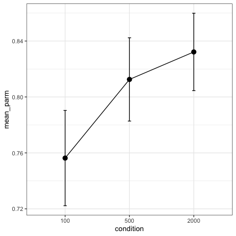<!-- -->

``` r

data <- bays2009_full

model_fit <- fit_mixtur(data,
                        components=  3,
                        unit = "radians",
                        id_var = "id",
                        response_var = "response",
                        target_var = "target",
                        non_target_var = "non_target",
                        set_size_var = "set_size",
                        condition_var = "delay")
#> [1] "Model fit running. Please wait..."
#> [1] "Model fit finished."

plot_model_fit(human_data = data,
               model_fit = model_fit,
               unit = "radians",
               id_var = "id",
               response_var = "response",
               target_var = "target",
               set_size_var = "set_size",
               condition_var = "delay")
```

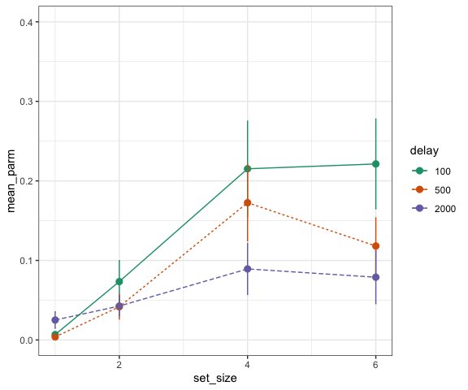<!-- -->

### Plotting model parameter values

#### Visualising set size

``` r

# load the data
data <- bays2009_full

# fit the 3-component model to the data
model_fit <- fit_mixtur(data = data,
                  components = 3,
                  unit = "radians",
                  id_var = "id",
                  response_var = "response",
                  target_var = "target",
                  non_target_var = "non_target",
                  set_size_var = "set_size",
                  condition_var = NULL)
#> [1] "Model fit running. Please wait..."
#> [1] "Model fit finished."

# plot the best-fitting parameter values
plot_parameters(model_fit = model_fit, 
                id_var = "id",
                set_size_var = "set_size",
                condition_var = NULL,
                return_data = FALSE)
```

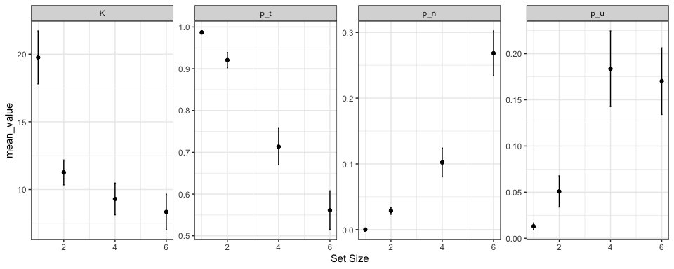<!-- -->

#### Visualising condition

``` r

# load the data
data <- bays2009_full

# select set size of 4
data <- data %>% 
  filter(set_size == 4) %>% 
  select(-non_target_4, -non_target_5)

# fit the 3-component model to the data
model_fit <- fit_mixtur(data = data,
                  components = 3,
                  unit = "radians",
                  id_var = "id",
                  response_var = "response",
                  target_var = "target",
                  non_target_var = "non_target",
                  set_size_var = NULL,
                  condition_var = "delay")
#> [1] "Model fit running. Please wait..."
#> [1] "Model fit finished."

# plot the best-fitting parameter values
plot_parameters(model_fit = model_fit, 
                id_var = "id",
                set_size_var = NULL,
                condition_var = "delay",
                return_data = FALSE)
```

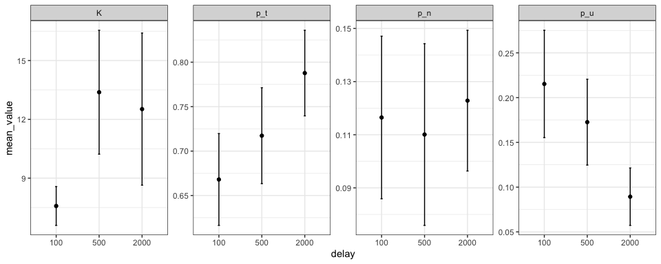<!-- -->

#### Visualising both set size & condition

``` r

# load the data
data <- bays2009_full

# fit the 3-component model to the data
model_fit <- fit_mixtur(data = data,
                  components = 3,
                  unit = "radians",
                  id_var = "id",
                  response_var = "response",
                  target_var = "target",
                  non_target_var = "non_target",
                  set_size_var = "set_size",
                  condition_var = "delay")
#> [1] "Model fit running. Please wait..."
#> [1] "Model fit finished."

# plot the best-fitting parameter values
plot_parameters(model_fit = model_fit, 
                id_var = "id",
                set_size_var = "set_size",
                condition_var = "delay",
                return_data = FALSE)
```

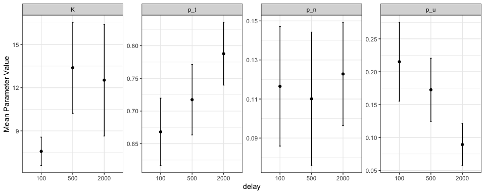<!-- -->

## Simulating: Generating Data From Mixture Models

## Two-component model

``` r
simulated_data <- simulate_mixtur(n_trials = 5000, 
                                  K = 15, 
                                  p_u = 0.25, 
                                  set_size = 4)
#> [1] "Simulating data. Please wait..."
#> [1] "Simulating data finished."

head(simulated_data)
#>   id target response non_target_1 non_target_2 non_target_3
#> 1  1  0.436   -0.772       -1.641        2.356        0.925
#> 2  1 -1.780    0.139        0.908        1.484        0.000
#> 3  1 -0.942    1.753        2.426        0.646       -0.401
#> 4  1 -3.002   -2.875       -0.105       -1.361        2.705
#> 5  1 -1.292   -1.200       -0.175        0.925        0.436
#> 6  1  2.426   -0.380        1.012        1.833        2.915

fit <- fit_mixtur(data = simulated_data,
                  components = 2,
                  unit = "radians",
                  id_var = "id",
                  response_var = "response",
                  target_var = "target",
                  non_target_var = "non_target",
                  set_size_var = NULL,
                  condition_var = NULL)
#> [1] "Model fit running. Please wait..."
#> [1] "Model fit finished."

head(fit)
#>   id     K   p_t   p_u
#> 1  1 15.24 0.754 0.246
```

### Three-component model

``` r
simulated_data <- simulate_mixtur(n_trials = 5000, 
                                  K = 15, 
                                  p_n = 0.15, 
                                  p_u = 0.10, 
                                  set_size = 4)
#> [1] "Simulating data. Please wait..."
#> [1] "Simulating data finished."

head(simulated_data)
#>   id target response non_target_1 non_target_2 non_target_3
#> 1  1  0.367   -0.105        0.855       -1.012        2.164
#> 2  1 -2.793   -2.366       -2.251        2.862        0.349
#> 3  1  1.082    0.853        0.105       -2.269       -1.152
#> 4  1  2.374    2.661        0.646       -2.775        1.414
#> 5  1  0.471    0.731       -2.897        2.496       -1.065
#> 6  1  1.309   -2.782       -2.775        2.548        1.710

fit <- fit_mixtur(data = simulated_data,
                  components = 3,
                  unit = "radians",
                  id_var = "id",
                  response_var = "response",
                  target_var = "target",
                  non_target_var = "non_target",
                  set_size_var = NULL,
                  condition_var = NULL)
#> [1] "Model fit running. Please wait..."
#> [1] "Model fit finished."

head(fit)
#>   id      K   p_t   p_n   p_u
#> 1  1 15.704 0.743 0.149 0.108
```

## Designing

Coming soon\!

## References

Bays, P. M., Catalao, R. F. G., & Husain, M. (2009). The precision of
visual working memory is set by allocation of a shared resource.
*Journal of Vision, 9*(10): 7, 1–11.

Zhang, W., & Luck, S. J. (2008). Discrete fixed-resolution
representations in visual working memory. *Nature, 453,* 233–235.
